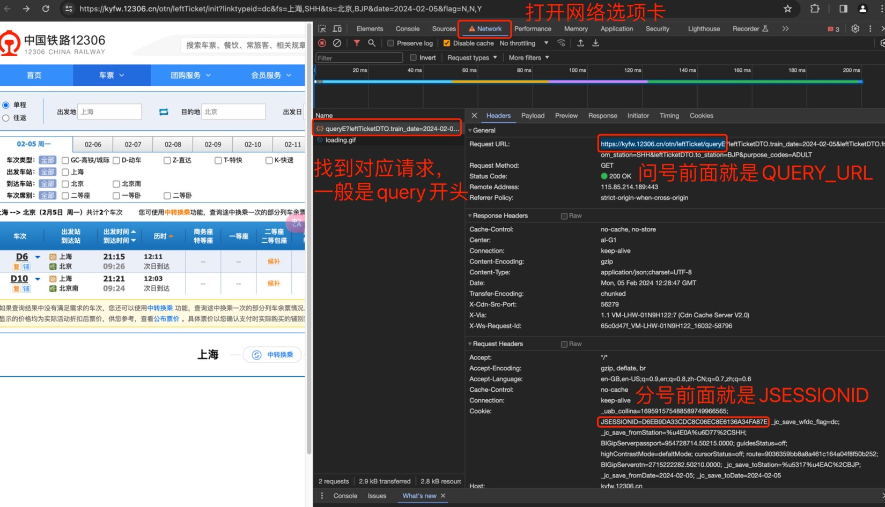

# x12306

12306查票助手，主要功能是可以一键查询沿途所有站点。

当全程票售罄的时候，方便查询中间站点余票，先上车后补票。

工具仅用于查询余票，不支持购票，建议在12306官方平台购票。

仅支持Python3，推荐Python3.5+

**使用前需要修改`glovar.py`中的`QUERY_URL`和`JSESSIONID`**

## 获取QUERY_URL和JSESSIONID

1. 打开浏览器，访问 https://www.12306.cn/index/
2. 随便查询一个车次，如上海 > 北京
3. 按F12（或CMD+Option+I）打开浏览器控制台，打开网络（Network）选项卡
4. 找到查询车次的请求，如果没找到，可以再点一下查询
5. 在`glovar.py`中修改`QUERY_URL`和`JSESSIONID`



## 安装运行

手动安装：
```bash
git clone https://github.com/0xHJK/x12306
cd x12306 && make install
```

不安装直接运行：
```bash
git clone https://github.com/0xHJK/x12306
cd x12306
python3 x12306.py -f <出发地> -t <目的地> -d <YYYY-MM-DD> -z
```

## 使用方法

```
$ x12306 --help
Usage: x12306.py [OPTIONS]

  12306查票助手 https://github.com/0xHJK/x12306

  Example：python x12306.py -f 上海 -t 北京 -d "2019-03-01" -n "G16 G18 G22" -r

  如果查询失败的话，请修改glovar.py中的QUERY_URL和JSESSIONID

Options:
  --version                Show the version and exit.
  -f, --from-station TEXT  出发地
  -t, --to-station TEXT    目的地
  -d, --date TEXT          日期
  -s, --seats TEXT         限制座位
  -n, --train-no TEXT      限制车次
  -z, --zmode              高级模式，查询中间站点
  -zz, --zzmode            终极模式，查询所有中间站点
  -r, --remaining          只看有票
  --gcd                    只看高铁动车城际
  --ktz                    只看普快特快直达等
  --proxies-file TEXT      代理列表文件
  --stations-file TEXT     站点信息文件
  --cdn-file TEXT          CDN文件
  --help                   Show this message and exit.
```

## 使用示例


## LICENSE
[MIT License](https://github.com/0xHJK/x12306/blob/master/LICENSE)
